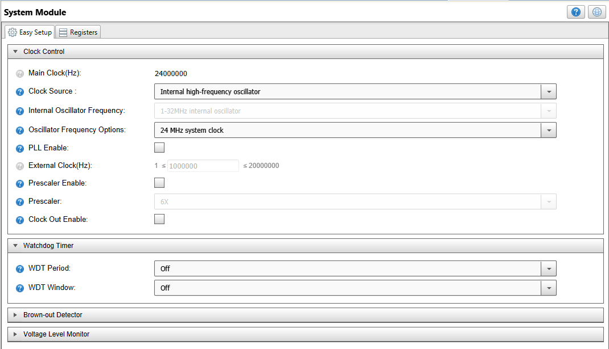
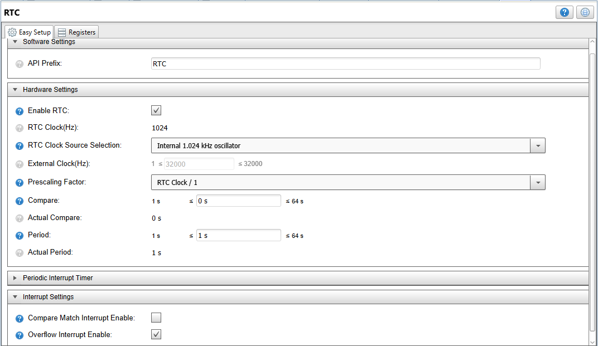
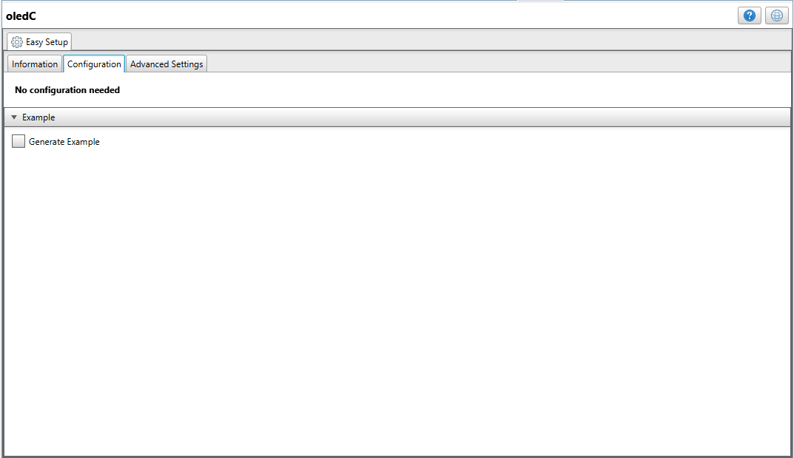
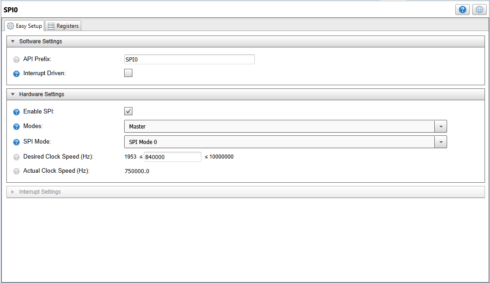
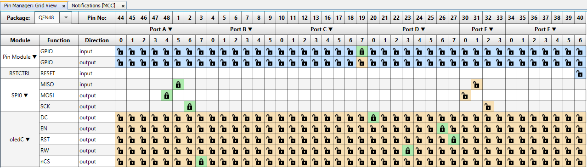
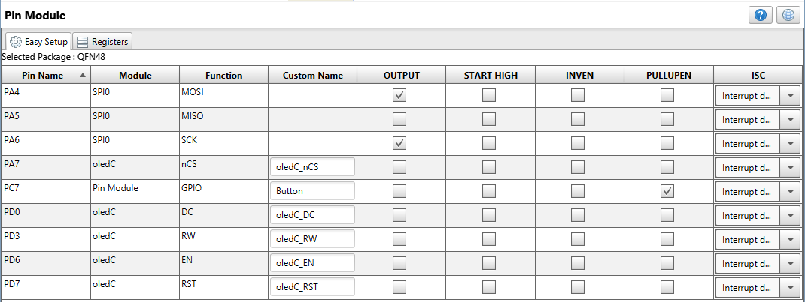
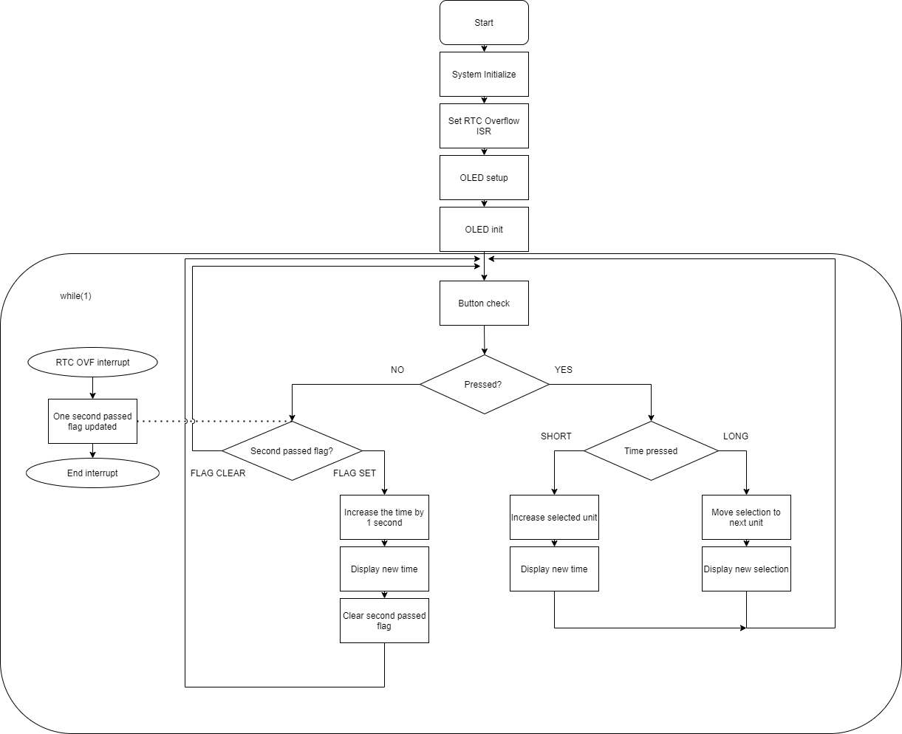

# Desk Clock using RTC and an OLED Click

This repository represents an MPLAB X project for an application that shows the current time using an OLED screen. The clock is configurable by the Curiosity Nano's on-board button.  

## Related Documentation
More details and code examples on the AVR128DA48 can be found at the following links:
- [AVR128DA48 Product Page](https://www.microchip.com/wwwproducts/en/AVR128DA28)
- [AVR128DA48 Code Examples on GitHub](https://github.com/microchip-pic-avr-examples?q=avr128da48)
- [AVR128DA48 Project Examples in START] (https://start.atmel.com/#examples/AVR128DA48CuriosityNano)

## Software Used
- MPLAB® X IDE 5.40 or newer [(microchip.com/mplab/mplab-x-ide)](http://www.microchip.com/mplab/mplab-x-ide)
- MPLAB® XC8 2.20 or newer [(microchip.com/mplab/compilers)](http://www.microchip.com/mplab/compilers)
- MPLAB® Code Configurator (MCC) 3.95.0 or newer [(microchip.com/mplab/mplab-code-configurator)](https://www.microchip.com/mplab/mplab-code-configurator)
- AVR-Dx_DFP 1.1.40 or newer Device Pack
- 8-bit AVR MCUs Lib version 2.3.0

## Hardware Used
- AVR128DA48 Curiosity Nano [(DM164151)](https://www.microchip.com/Developmenttools/ProductDetails/DM164151)
- Curiosity Nano Base for Click Boards [(AC164162)](https://www.microchip.com/developmenttools/ProductDetails/AC164162)
- OLED C Click – Mikroe [(MIKROE-1585)](https://www.mikroe.com/oled-c-click)

The OLED C Click is connected to the first slot on the Base board.

## Setup
The AVR128DA48 Curiosity Nano Development Board is used as test platform.
 

The following MCC configurations must be made for this project:

 - System Module
    1. Internal Oscillator (24 MHz)
    2. Prescaler disabled
    3. WDT disabled

 

- Interrupt manager
	1. Enable Global interrupts

- RTC 
	1. Internal 1.024 kHz oscillator
	2. 1 second period
	3. Overflow interrupt enabled
	
 
	
- OLED C
	1. Do not generate example

 

- SPI
	1. Generated by OLED C
	2. MISO as PA5, MOSI as PA4 and SCK as PA6.

 

- Pin Manager
    1. PA7 as output named "oledC_nCS"
	2. PC7 as input with Pull up enabled named "Button"
	3. PD0 as output named "oledC_DC"
	4. PD3 as output named "oledC_RW"
	5. PD6 as output named "oledC_EN"
	6. PD7 as output named "oledC_RST"
	
 
 

## Demo Code 

The source code for this project can be downloaded from the current page by clicking the "Download" button, or if you want to make your own project, please pay attention to the following steps:
 - After making the MCC settings, press the "Generate" button, and this will generate the required .c and .h files.
 - Several files have to be added to the project and some of the generated files (oledC.c and pin_manager.c)  have to be modified. It is strongly encouraged to use the whole project downloaded from here.

The flow diagram is presented in the picture below:

 

## Operation

1. Connect the AVR128DA48 Curiosity Nano Development Board to PC using the USB cable.
2. Build the firmware and load the generated hex file into MCU.

## Demo:

After the code has been compiled and loaded onto the device, the OLED should light up and start counting. The digits can be changed by pressing the button. A long press changes the selection.

## Summary
This example represents a real time clock displayed on an OLED screen.